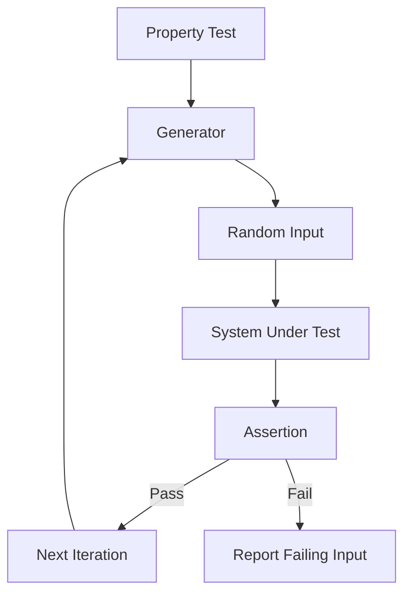

# Design Document: Comprehensive Property-Based Testing

## Overview

This design implements a property-based testing framework for the LuaBots library, integrated with the busted test framework. The framework will generate random test inputs to verify system invariants, edge cases, and error conditions across the bot command system.

The implementation consists of three main components:

1. A lightweight property-based testing framework (`spec/property.lua`) that integrates with busted
2. Test data generators for creating random valid inputs (`spec/generators.lua`)
3. Comprehensive property-based test suites that verify system correctness

The framework will enable testing universal properties like "for all valid Actionable types, tostring produces a string containing the type" rather than testing individual examples. This approach provides higher confidence in system correctness by testing hundreds of randomly generated inputs per property.

## Architecture

### Component Structure

```
spec/
├── property.lua           # Property-based testing framework
├── generators.lua         # Random data generators
├── property_actionable_spec.lua    # Actionable system properties
├── property_commands_spec.lua      # Command formatting properties
├── property_enums_spec.lua         # Enum integration properties
├── property_mq_stub_spec.lua       # MQ stub properties
└── init_spec.lua          # Existing example-based tests (unchanged)
```

### Framework Design

The property-based testing framework provides:

- **Generator API**: Functions to create random test data (integers, strings, list selections, booleans)
- **Property runner**: Executes a property test multiple times with different random inputs
- **Failure reporting**: Captures and reports the specific input that caused a property violation
- **Busted integration**: Works seamlessly with busted's `describe`, `it`, and `assert` functions

### Data Flow



## Components and Interfaces

### Property Framework (`spec/property.lua`)

```lua
-- Core API
property = {
  -- Run a property test with random inputs
  forall(generators, test_function, options)
  
  -- Generator functions
  integer(min, max)
  string(length_min, length_max, charset)
  oneof(list)
  boolean()
  
  -- Utility functions
  sample(generator, count)  -- Generate sample values for debugging
}
```

**Key Functions:**

- `property.forall(generators, test_fn, opts)`: Runs `test_fn` multiple times with random inputs from `generators`. Options include `iterations` (default 100) and `seed` for reproducibility.

- `property.integer(min, max)`: Returns a generator that produces random integers in [min, max].

- `property.string(len_min, len_max, charset)`: Returns a generator that produces random strings. Default charset is alphanumeric.

- `property.oneof(list)`: Returns a generator that randomly selects from the provided list.

- `property.boolean()`: Returns a generator that produces true or false.

### Test Generators (`spec/generators.lua`)

```lua
generators = {
  -- Actionable generators
  actionable_type_requiring_selector()
  actionable_type_not_requiring_selector()
  actionable_with_selector()
  actionable_without_selector()
  any_actionable()
  selector_string()
  
  -- Enum generators
  class_value()
  race_value()
  gender_value()
  spell_type_value()
  stance_value()
  material_slot_value()
  pet_type_value()
  slot_value()
  any_enum_value()
  
  -- Command generators
  command_name()
  command_with_actionable()
  command_with_optional_params()
  
  -- Parameter generators
  bot_name()
  numeric_parameter()
  string_parameter()
}
```

These generators build on the primitive generators from `property.lua` to create domain-specific test data.

### Integration Points

The property-based tests integrate with existing code through:

1. **Actionable module**: Tests create Actionable instances and verify their behavior
2. **LuaBots command methods**: Tests call command methods and capture output
3. **MQ stub**: Tests interact with the mq stub to verify command formatting
4. **Enum modules**: Tests iterate through enum values to verify integration

## Data Models

### Property Test Structure

```lua
{
  name = "Property description",
  generators = { gen1, gen2, ... },
  test = function(val1, val2, ...)
    -- Test logic with assertions
  end,
  iterations = 100,  -- optional, default 100
  seed = 12345       -- optional, for reproducibility
}
```

### Generator Structure

```lua
{
  generate = function(rng)
    -- Return a random value using rng
  end,
  shrink = function(value)  -- optional, for future enhancement
    -- Return simpler values to minimize failing case
  end
}
```

### Test Output Capture

```lua
{
  output = "",  -- Captured stdout
  success = true/false,
  error = nil or error_message
}
```

## Correctness Properties

*A property is a characteristic or behavior that should hold true across all valid executions of a system—essentially, a formal statement about what the system should do. Properties serve as the bridge between human-readable specifications and machine-verifiable correctness guarantees.*

### Property 1: Actionable types requiring selectors error without them

*For any* actionable type that requires a selector (as defined in RequiresSelector table), creating an Actionable without a selector should raise an error.

**Validates: Requirements 2.1**

### Property 2: Actionable types not requiring selectors error with them

*For any* actionable type that does not require a selector, creating an Actionable with a selector should raise an error.

**Validates: Requirements 2.2**

### Property 3: Valid actionable combinations create instances

*For any* valid combination of actionable type and selector (or no selector when not required), the Actionable.new function should successfully create an Actionable instance.

**Validates: Requirements 2.3**

### Property 4: Actionable tostring format correctness

*For any* Actionable instance, the tostring output should contain the actionable type, and if a selector is present, it should contain both the type and selector separated by a space.

**Validates: Requirements 2.4, 2.5, 2.6, 10.3**

### Property 5: All commands start with "/say ^"

*For any* bot command method called on LuaBots, the output should start with the prefix "/say ^".

**Validates: Requirements 3.1**

### Property 6: Command parameters are space-separated

*For any* bot command with non-nil parameters, the output should separate all parameters with single spaces.

**Validates: Requirements 3.2**

### Property 7: Actionables appear at command end

*For any* bot command called with an Actionable parameter, the Actionable's string representation should appear at the end of the command output.

**Validates: Requirements 3.3**

### Property 8: Command output is deterministic

*For any* bot command called twice with identical parameters, the output should be identical both times.

**Validates: Requirements 3.4, 10.4**

### Property 9: Nil parameters are omitted

*For any* bot command with nil parameters, those parameters should not appear in the output string.

**Validates: Requirements 3.5**

### Property 10: Parameters are converted to strings

*For any* bot command with non-string parameters (numbers, booleans, enums), all parameters should be converted to strings using tostring.

**Validates: Requirements 3.6, 5.6, 5.7**

### Property 11: All enum values produce valid commands

*For any* enum value from any enum type (Class, Race, Gender, SpellType, Stance, MaterialSlot, PetType, Slot), when used in an appropriate command, the system should produce a valid command string starting with "/say ^".

**Validates: Requirements 4.1, 4.2, 4.3, 4.4, 4.5, 4.6, 4.7, 4.8, 10.5**

### Property 12: Invalid actionable types raise errors

*For any* string that is not a valid actionable type, attempting to create an Actionable should raise an error containing a descriptive message.

**Validates: Requirements 5.1**

### Property 13: Long selectors are accepted

*For any* string of length up to 1000 characters, when used as a selector for an actionable type requiring selectors, the Actionable should be created successfully.

**Validates: Requirements 5.4**

### Property 14: Special characters in selectors are accepted

*For any* string containing special characters (spaces, punctuation, unicode), when used as a selector for an actionable type requiring selectors, the Actionable should be created successfully.

**Validates: Requirements 5.5**

### Property 15: MQ stub outputs commands with newlines

*For any* command string passed to mq.cmd, the output should be the command followed by a newline character.

**Validates: Requirements 6.1**

### Property 16: MQ cmdf is equivalent to format then cmd

*For any* format string and arguments passed to mq.cmdf, the output should be identical to calling string.format with those arguments and then passing the result to mq.cmd.

**Validates: Requirements 6.2**

### Property 17: MQ delay completes without error

*For any* numeric delay value between 0 and 10000, calling mq.delay should complete without raising an error.

**Validates: Requirements 6.3**

### Property 18: MQ event registration stores callbacks

*For any* event name and callback function, after calling mq.event.register, the callback should be stored and retrievable.

**Validates: Requirements 6.4**

### Property 19: MQ event triggers invoke callbacks

*For any* registered event, when triggered with arguments, the callback should be invoked with those exact arguments.

**Validates: Requirements 6.5**

### Property 20: Optional parameters can be omitted

*For any* command with optional parameters (value or Actionable), calling the command without those parameters should produce a valid command string.

**Validates: Requirements 7.1, 7.2**

### Property 21: Multi-parameter commands preserve order

*For any* command accepting multiple parameters, when called with all parameters, the output should include all parameters in the correct order as defined by the function signature.

**Validates: Requirements 7.3, 7.4**

### Property 22: Maximum parameter values are handled

*For any* command with numeric parameters, when called with maximum valid values (e.g., 255 for colors, 100 for percentages), the command should produce valid output.

**Validates: Requirements 7.5**

### Property 23: RequiresSelector table matches behavior

*For any* actionable type in the RequiresSelector table, attempting to create an Actionable of that type without a selector should raise an error, and for any actionable type not in the table, attempting to create an Actionable with a selector should raise an error.

**Validates: Requirements 8.5**

### Property 24: Botcreate produces valid commands for all combinations

*For any* valid combination of name, class, race, and gender, calling botcreate should produce a command string starting with "/say ^botcreate" and return a table with Name, Class, Race, and Gender fields matching the inputs.

**Validates: Requirements 9.1, 9.2, 9.3**

### Property 25: Commands with Actionables are longer

*For any* command that accepts an Actionable parameter, the length of the output with an Actionable should be strictly greater than the length without an Actionable.

**Validates: Requirements 10.1**

### Property 26: Commands with parameters are longer or equal

*For any* command with value parameters, the length of the output with parameters should be greater than or equal to the base command length (command with no parameters).

**Validates: Requirements 10.2**

## Error Handling

### Generator Errors

- **Invalid generator configuration**: If a generator is configured with invalid parameters (e.g., min > max for integer generator), it should raise an error immediately when the generator is created, not during test execution.

- **Generation failure**: If a generator cannot produce a valid value (e.g., selecting from an empty list), it should raise an error with a clear message indicating the problem.

### Property Test Failures

- **Assertion failure**: When a property test fails, the framework should:
  1. Capture the failing input values
  2. Report the property name and description
  3. Show the exact input that caused the failure
  4. Display the assertion error message
  5. Stop further iterations for that property

- **Error during test execution**: If the test function raises an error (not an assertion failure), the framework should report it as a test error with the failing input.

### Edge Cases

- **Empty selectors**: Empty strings are valid selectors (tested as edge case)
- **Nil actionable type**: Should raise error (tested as edge case)
- **Numeric string conversion**: Numbers should convert cleanly to strings
- **Boolean string conversion**: true → "true", false → "false"

### Error Messages

All error messages should be descriptive and include:
- What went wrong
- What was expected
- What was received (if applicable)
- Context (e.g., which actionable type, which command)

## Testing Strategy

### Dual Testing Approach

This feature implements both property-based tests and example-based tests:

**Property-Based Tests** (new):
- Verify universal properties across many random inputs
- Test invariants that should hold for all valid inputs
- Provide comprehensive coverage through randomization
- Each property test runs 100 iterations by default
- Focus on "for all" statements from requirements

**Example-Based Tests** (existing in `init_spec.lua`):
- Verify specific examples and known edge cases
- Test integration points between components
- Provide regression tests for specific bugs
- Remain unchanged by this feature

Both approaches are complementary and necessary for comprehensive coverage.

### Property-Based Testing Configuration

**Framework**: Custom lightweight framework in `spec/property.lua`
- Integrates with busted's describe/it/assert
- Generates random inputs using Lua's math.random
- Configurable iteration count (default: 100)
- Reports failing inputs for debugging

**Test Organization**:
- One spec file per major component (Actionable, commands, enums, MQ stub)
- Each property test tagged with comment referencing design property
- Tag format: `-- Feature: comprehensive-property-based-testing, Property N: <description>`

**Example Property Test Structure**:

```lua
describe("Actionable properties", function()
  it("Property 1: types requiring selectors error without them", function()
    -- Feature: comprehensive-property-based-testing, Property 1
    property.forall(
      { generators.actionable_type_requiring_selector() },
      function(actionable_type)
        assert.has_error(function()
          Actionable.new(actionable_type, nil)
        end)
      end,
      { iterations = 100 }
    )
  end)
end)
```

### Test Coverage

The property-based tests will cover:

1. **Actionable System** (20 properties):
   - Selector validation (required vs not required)
   - Instance creation with valid combinations
   - String representation format
   - Error handling for invalid types

2. **Command Formatting** (15 properties):
   - Command prefix consistency
   - Parameter spacing and ordering
   - Actionable placement
   - Nil parameter handling
   - Type conversion

3. **Enum Integration** (8 properties):
   - All enum values produce valid commands
   - Enum-to-string conversion
   - Integration with specific commands

4. **MQ Stub** (6 properties):
   - Command output format
   - cmdf equivalence to format+cmd
   - Delay handling
   - Event registration and triggering

5. **Bot Creation** (3 properties):
   - Valid parameter combinations
   - Return value structure
   - API integration (example-based)

6. **Metamorphic Properties** (4 properties):
   - Length relationships
   - Determinism
   - Non-empty outputs

### Running Tests

```bash
# Run all tests (example-based and property-based)
busted -v spec

# Run only property-based tests
busted -v spec/property_*.lua

# Run specific property test file
busted -v spec/property_actionable_spec.lua

# Run with specific seed for reproducibility
PROPERTY_SEED=12345 busted -v spec
```

### Test Execution Time

- Example-based tests: ~1-2 seconds
- Property-based tests: ~5-10 seconds (100 iterations × ~50 properties)
- Total test suite: ~10-15 seconds

This is acceptable for a comprehensive test suite that provides high confidence in correctness.
